# Digit Link — Database Diagram & Schema

This document is the **single source of truth** for making the Digit Link clone
fully dynamic (DB-backed) instead of mock-JSON-backed. Every screen currently
fed by `data/mock/*.json`, `data/providers.*.json`, `lib/*.ts` config, and the
in-memory `AuthProvider` maps onto exactly one table below.

- **Engine:** PostgreSQL 15+ (types below use Postgres). Any Prisma/Drizzle/SQL
  layer can be generated from this.
- **Conventions:** `snake_case` tables & columns, plural table names, `id` PK
  (`uuid` default `gen_random_uuid()` unless noted), `numeric(18,2)` for money /
  coin amounts (stored as strings today — keep 2-decimal precision), UTC
  `timestamptz` for all times, soft config marked *seed/reference data*.
- **Currencies:** `GC` = Gold Coins (play-only, non-redeemable), `SC` =
  Sweepstakes Coins (redeemable).

---

## 1. Entity-Relationship Diagram

```mermaid
erDiagram
    users ||--|| wallets : has
    users ||--o{ orders : places
    users ||--o{ transactions : owns
    users ||--o{ user_provider_accounts : links
    users ||--o{ user_bonus_claims : claims
    users ||--o{ redemption_reviews : submits
    users ||--o{ referral_commissions : "earns (as referrer)"
    users ||--o{ user_profile_task_claims : progresses
    users ||--o{ sessions : authenticates
    users ||--o{ otp_codes : verifies
    users ||--o{ postal_requests : submits
    users ||--o{ support_tickets : opens
    users ||--o{ users : "referred_by"

    game_providers ||--o{ provider_deposit_tiers : offers
    game_providers ||--o{ user_provider_accounts : "played via"
    game_providers ||--o{ redemption_reviews : "redeemed from"

    bonuses ||--o{ user_bonus_claims : "claimed as"

    profile_tasks ||--o{ user_profile_task_claims : "completed as"

    help_sections ||--o{ help_items : contains
    help_items ||--o{ help_steps : contains

    users {
        uuid id PK
        text username UK
        text nickname
        text password_hash
        text phone
        boolean phone_bound
        text email
        text avatar_url
        text avatar_emoji
        kyc_status kyc_status
        boolean pwa_installed
        text invite_code UK
        uuid referred_by_user_id FK
        timestamptz created_at
    }
    wallets {
        uuid id PK
        uuid user_id FK "UK"
        numeric gold_coin
        numeric online_sc
        numeric store_sc
        numeric kiosk_sc
        numeric unwagered
        numeric free_bonus
    }
    game_providers {
        int id PK
        text name
        text provider_code
        text launch_url_template
        text icon_url
        provider_type provider_type
        smallint status
        smallint sort
    }
    provider_deposit_tiers {
        uuid id PK
        int provider_id FK
        numeric amount
        numeric bonus_amount
        smallint sort
    }
    user_provider_accounts {
        uuid id PK
        uuid user_id FK
        int provider_id FK
        text game_username
        text game_password_enc
        numeric balance
        boolean initialized
    }
    orders {
        uuid id PK
        text order_no UK
        uuid user_id FK
        numeric amount
        numeric pay_amount
        numeric actual_deposit_amount
        text payment_method
        numeric fee
        fee_mode fee_mode
        boolean fee_waived
        numeric sc_bonus
        order_status status
        timestamptz created_at
    }
    transactions {
        text id PK
        uuid user_id FK
        text address
        text method_label
        payment_method method
        tx_status status
        numeric amount
        tx_type type
        timestamptz created_at
    }
    bonuses {
        text id PK
        text title
        text description
        text[] tags
        boolean active
        banner_type banner_type
        text banner_gradient
        badge_icon banner_badge_icon
        text banner_badge_text
        schedule_icon schedule_icon
        text schedule_text
        int schedule_countdown_seconds
        smallint sort
    }
    user_bonus_claims {
        uuid id PK
        uuid user_id FK
        text bonus_id FK
        bonus_status status
        timestamptz claimed_at
        timestamptz next_available_at
    }
    referral_commissions {
        uuid id PK
        uuid referrer_user_id FK
        uuid invitee_user_id FK
        text invitee_display
        numeric reward
        referral_status status
        timestamptz joined_at
    }
    redemption_reviews {
        uuid id PK
        text order_no
        uuid user_id FK
        int provider_id FK
        numeric amount
        review_status status
        boolean visible
        timestamptz submitted_at
    }
    profile_tasks {
        text key PK
        text title
        text description
        int reward_gc
        int reward_sc
        smallint sort
    }
    user_profile_task_claims {
        uuid id PK
        uuid user_id FK
        text task_key FK
        timestamptz completed_at
        boolean reward_claimed
    }
    sessions {
        uuid id PK
        uuid user_id FK
        text token UK
        timestamptz expires_at
    }
    otp_codes {
        uuid id PK
        uuid user_id FK
        text destination
        text code
        otp_purpose purpose
        timestamptz expires_at
        boolean consumed
    }
    postal_requests {
        uuid id PK
        uuid user_id FK
        text code
        postal_status status
        timestamptz created_at
    }
    support_tickets {
        uuid id PK
        uuid user_id FK
        text email
        text message
        ticket_status status
        timestamptz created_at
    }
    content_pages {
        text slug PK
        text title
        text body
        timestamptz updated_at
    }
    banners {
        uuid id PK
        text image_url
        text link_url
        boolean active
        smallint sort
    }
    help_sections {
        uuid id PK
        help_tab tab
        text key
        text label
        help_section_icon icon
        smallint sort
    }
    help_items {
        uuid id PK
        uuid section_id FK
        text title
        help_item_icon icon
        text body
        smallint sort
    }
    help_steps {
        uuid id PK
        uuid item_id FK
        text title
        text description
        smallint sort
    }
    site_settings {
        text key PK
        text value
        setting_type type
        text group
        boolean is_public
    }
    social_links {
        uuid id PK
        social_platform platform UK
        text label
        text url
        boolean active
        smallint sort
    }
    admins ||--o{ admin_roles : has
    roles ||--o{ admin_roles : "assigned to"
    roles ||--o{ role_permissions : grants
    permissions ||--o{ role_permissions : "granted by"
    admins ||--o{ admin_permissions : "overridden by"
    permissions ||--o{ admin_permissions : "targets"
    admins ||--o{ admin_sessions : "logs in via"
    admins ||--o{ admin_invitations : sends
    roles ||--o{ admin_invitations : "pre-assigns"
    admins ||--o{ admin_audit_logs : performs
    admins ||--o{ media_assets : uploads
    users ||--o{ media_assets : uploads
    admins {
        uuid id PK
        text username UK
        text email UK
        text password_hash
        admin_status status
        uuid created_by_admin_id FK
    }
    roles {
        uuid id PK
        text name UK
        text slug UK
        smallint level
        boolean is_system
    }
    permissions {
        uuid id PK
        text key UK
        text resource
        text action
        text group
        boolean is_system
    }
    role_permissions {
        uuid role_id FK
        uuid permission_id FK
    }
    admin_roles {
        uuid admin_id FK
        uuid role_id FK
    }
    admin_permissions {
        uuid admin_id FK
        uuid permission_id FK
        permission_effect effect
    }
    admin_sessions {
        uuid id PK
        uuid admin_id FK
        text token UK
        timestamptz expires_at
        timestamptz revoked_at
    }
    admin_invitations {
        uuid id PK
        text email
        text token UK
        uuid role_id FK
        invitation_status status
        timestamptz expires_at
    }
    admin_audit_logs {
        uuid id PK
        uuid admin_id FK
        text action
        text entity_type
        jsonb changes
    }
    media_assets {
        uuid id PK
        text r2_key UK
        text bucket
        media_kind kind
        text content_type
        boolean is_private
        uuid uploaded_by_admin_id FK
        uuid uploaded_by_user_id FK
    }
```



---

## 2. Enumerated types

```sql
CREATE TYPE kyc_status          AS ENUM ('unverified','pending','verified','rejected');
CREATE TYPE provider_type       AS ENUM ('SC','GC');
CREATE TYPE order_status        AS ENUM ('pending','completed','failed','cancelled');
CREATE TYPE fee_mode            AS ENUM ('standard','waiver');
CREATE TYPE payment_method      AS ENUM ('cashapp','btc','lightning','pyusd','ach','card','chime');
CREATE TYPE tx_status           AS ENUM ('pending','completed','failed','cancelled');
CREATE TYPE tx_type             AS ENUM ('deposit','withdraw');
CREATE TYPE banner_type         AS ENUM ('placeholder','gradient');
CREATE TYPE banner_badge_icon   AS ENUM ('coin','percent');
CREATE TYPE schedule_icon       AS ENUM ('calendar','clock');
CREATE TYPE bonus_status        AS ENUM ('claimable','claimed','locked','none');
CREATE TYPE referral_status     AS ENUM ('pending','claimed');
CREATE TYPE review_status       AS ENUM ('reviewing','approved','rejected');
CREATE TYPE otp_purpose         AS ENUM ('register','login','bind_phone','reset_password');
CREATE TYPE postal_status       AS ENUM ('pending','completed','rejected');
CREATE TYPE ticket_status       AS ENUM ('open','answered','closed');
CREATE TYPE help_tab            AS ENUM ('general','deposit','withdraw');
CREATE TYPE help_section_icon   AS ENUM ('video','faq','guide');
CREATE TYPE help_item_icon      AS ENUM ('play','coins','btc','pyusd');
CREATE TYPE setting_type        AS ENUM ('string','number','boolean','json','url','color','image');
CREATE TYPE social_platform     AS ENUM ('facebook','instagram','twitter','telegram','whatsapp','youtube','tiktok','discord','email','livechat');
CREATE TYPE admin_status        AS ENUM ('active','suspended','invited');
CREATE TYPE media_kind          AS ENUM ('avatar','provider_icon','banner','logo','social_icon','content','kyc_doc','other');
CREATE TYPE permission_effect   AS ENUM ('allow','deny');
CREATE TYPE invitation_status   AS ENUM ('pending','accepted','revoked','expired');
```

---

## 3. Tables

Legend for **Source**: where the data lives today, so the migration/seed step is unambiguous.

### 3.1 `users`
Replaces the in-memory `MockUser` in `lib/auth-context.tsx` plus the auth modals.

| Column | Type | Constraints | Notes |
|---|---|---|---|
| `id` | uuid | PK | |
| `username` | text | UNIQUE, NOT NULL | login handle, e.g. `player_2481` |
| `nickname` | text | NOT NULL | display name |
| `password_hash` | text | NOT NULL | bcrypt/argon2; never returned to client |
| `phone` | text | NULL | E.164 |
| `phone_bound` | boolean | NOT NULL DEFAULT false | drives `BindPhoneModal`/`KycBanner` |
| `email` | text | NULL | |
| `avatar_url` | text | NULL | uploaded avatar |
| `avatar_emoji` | text | NOT NULL DEFAULT '🎰' | fallback avatar |
| `kyc_status` | kyc_status | NOT NULL DEFAULT 'unverified' | |
| `pwa_installed` | boolean | NOT NULL DEFAULT false | |
| `invite_code` | text | UNIQUE, NOT NULL | this user's own referral code (`referral.json.inviteCode`) |
| `referred_by_user_id` | uuid | FK → users.id NULL | who invited them |
| `created_at` | timestamptz | NOT NULL DEFAULT now() | |
| `updated_at` | timestamptz | NOT NULL DEFAULT now() | |

**Source:** `lib/auth-context.tsx` (`DEMO_USER`), `data/mock/referral.json` (invite code).
`inviteLink` is *derived*: `${NEXT_PUBLIC_SITE_URL}/?inviteCode=${invite_code}`.

### 3.2 `wallets` — 1:1 with users
| Column | Type | Constraints | Notes |
|---|---|---|---|
| `id` | uuid | PK | |
| `user_id` | uuid | FK → users.id, UNIQUE, NOT NULL | |
| `gold_coin` | numeric(18,2) | NOT NULL DEFAULT 0 | GC balance |
| `online_sc` | numeric(18,2) | NOT NULL DEFAULT 0 | |
| `store_sc` | numeric(18,2) | NOT NULL DEFAULT 0 | |
| `kiosk_sc` | numeric(18,2) | NOT NULL DEFAULT 0 | |
| `unwagered` | numeric(18,2) | NOT NULL DEFAULT 0 | SC still under wagering requirement |
| `free_bonus` | numeric(18,2) | NOT NULL DEFAULT 0 | |
| `updated_at` | timestamptz | NOT NULL DEFAULT now() | |

**Derived, do NOT store** (compute in the API/selector — matches `WalletBalance`):
- `totalBalance = online_sc + store_sc + kiosk_sc`
- `withdrawable = totalBalance − unwagered`

**Source:** `data/mock/wallet.json`.

### 3.3 `game_providers` — *reference data (live API cache)*
Direct row-for-row mapping of the `GameProvider` interface. Seeded from the live
public API (`PROVIDER_API_BASE_URL`) exactly as `lib/providers.ts` does today.

| Column | Type | Constraints | Notes |
|---|---|---|---|
| `id` | integer | PK | provider id from upstream API (not uuid) |
| `name` | text | NOT NULL | |
| `provider_code` | text | NOT NULL | |
| `launch_url_template` | text | NOT NULL | |
| `icon_url` | text | NOT NULL | CDN icon |
| `status` | smallint | NOT NULL | 1 = active |
| `sort` | smallint | NOT NULL DEFAULT 0 | grid order |
| `create_type` | smallint | NOT NULL | |
| `operate` | smallint | NOT NULL | |
| `need_init_balance` | smallint | NOT NULL | |
| `can_manual_input` | smallint | NOT NULL | |
| `provider_type` | provider_type | NOT NULL | SC / GC — splits the two grids |
| `iframe_supported` | boolean | NOT NULL | |
| `is_machine_supported` | smallint | NOT NULL | |
| `redeem_field` | smallint | NOT NULL | |
| `invalid_password_state` | smallint | NOT NULL | |
| `can_change_password` | smallint | NOT NULL | |
| `synced_at` | timestamptz | NOT NULL DEFAULT now() | last refresh from upstream |

**Source:** `data/providers.sc.json` (48 rows), `data/providers.gc.json` (2 rows).

### 3.4 `provider_deposit_tiers`
Normalizes the `depositTiers: DepositTier[] | null` array.

| Column | Type | Constraints | Notes |
|---|---|---|---|
| `id` | uuid | PK | |
| `provider_id` | integer | FK → game_providers.id, NOT NULL | |
| `amount` | numeric(18,2) | NOT NULL | |
| `bonus_amount` | numeric(18,2) | NOT NULL DEFAULT 0 | |
| `sort` | smallint | NOT NULL DEFAULT 0 | |

A provider with `null` tiers simply has zero rows here.

### 3.5 `user_provider_accounts`
The per-user game login/balance each provider maintains (implied by
`can_change_password`, `need_init_balance`, `redeem_field`, `invalid_password_state`).

| Column | Type | Constraints | Notes |
|---|---|---|---|
| `id` | uuid | PK | |
| `user_id` | uuid | FK → users.id, NOT NULL | |
| `provider_id` | integer | FK → game_providers.id, NOT NULL | |
| `game_username` | text | NOT NULL | |
| `game_password_enc` | text | NOT NULL | encrypted at rest |
| `balance` | numeric(18,2) | NOT NULL DEFAULT 0 | in-game balance |
| `initialized` | boolean | NOT NULL DEFAULT false | `need_init_balance` handshake done |
| `created_at` | timestamptz | NOT NULL DEFAULT now() | |
| `updated_at` | timestamptz | NOT NULL DEFAULT now() | |

**UNIQUE** (`user_id`, `provider_id`).

### 3.6 `orders` — deposit / recharge orders (`OrderRecord`)
| Column | Type | Constraints | Notes |
|---|---|---|---|
| `id` | uuid | PK | |
| `order_no` | text | UNIQUE, NOT NULL | e.g. `DL202607010001` |
| `user_id` | uuid | FK → users.id, NOT NULL | replaces `username` string |
| `amount` | numeric(18,2) | NOT NULL | |
| `pay_amount` | numeric(18,2) | NOT NULL | |
| `actual_deposit_amount` | numeric(18,2) | NOT NULL DEFAULT 0 | |
| `payment_method` | text | NOT NULL | human label, e.g. "Bitcoin Lightning Network" |
| `fee` | numeric(18,2) | NOT NULL DEFAULT 0 | |
| `fee_mode` | fee_mode | NOT NULL | |
| `fee_waived` | boolean | NOT NULL DEFAULT false | |
| `sc_bonus` | numeric(18,2) | NOT NULL DEFAULT 0 | |
| `status` | order_status | NOT NULL | |
| `created_at` | timestamptz | NOT NULL | maps `createTime` |

**Source:** `data/mock/orders.json`.

### 3.7 `transactions` — wallet ledger (`Transaction`)
| Column | Type | Constraints | Notes |
|---|---|---|---|
| `id` | text | PK | upstream id, e.g. `TX20260627001` |
| `user_id` | uuid | FK → users.id, NOT NULL | |
| `address` | text | NOT NULL | wallet address / handle (UI masks middle) |
| `method_label` | text | NOT NULL | "Cash App", "Bitcoin Network"… |
| `method` | payment_method | NOT NULL | |
| `status` | tx_status | NOT NULL | |
| `amount` | numeric(18,2) | NOT NULL | positive; sign derived from `type` |
| `type` | tx_type | NOT NULL | |
| `created_at` | timestamptz | NOT NULL | |

**Source:** `data/mock/transactions.json`.

### 3.8 `bonuses` — *reference data* (`BonusReward` definition)
Per-user claim state lives in `user_bonus_claims`; this holds the static definition.

| Column | Type | Constraints | Notes |
|---|---|---|---|
| `id` | text | PK | slug, e.g. `daily-checkin` |
| `title` | text | NOT NULL | |
| `description` | text | NOT NULL | |
| `tags` | text[] | NOT NULL DEFAULT '{}' | e.g. `{LONG-TERM,REFERRAL}` |
| `active` | boolean | NOT NULL DEFAULT true | |
| `banner_type` | banner_type | NOT NULL | |
| `banner_gradient` | text | NULL | Tailwind gradient classes (gradient banners) |
| `banner_badge_icon` | banner_badge_icon | NULL | |
| `banner_badge_text` | text | NULL | e.g. `+10K`, `+15%` |
| `schedule_icon` | schedule_icon | NOT NULL | |
| `schedule_text` | text | NOT NULL DEFAULT '' | e.g. "Every Day", "One-Time" |
| `schedule_countdown_seconds` | integer | NULL | daily countdown seed |
| `sort` | smallint | NOT NULL DEFAULT 0 | |

**Source:** `data/mock/bonus.json`.

### 3.9 `user_bonus_claims`
| Column | Type | Constraints | Notes |
|---|---|---|---|
| `id` | uuid | PK | |
| `user_id` | uuid | FK → users.id, NOT NULL | |
| `bonus_id` | text | FK → bonuses.id, NOT NULL | |
| `status` | bonus_status | NOT NULL DEFAULT 'none' | per-user state for `BonusReward.status` |
| `claimed_at` | timestamptz | NULL | |
| `next_available_at` | timestamptz | NULL | drives live countdown for daily bonuses |

**UNIQUE** (`user_id`, `bonus_id`). If no row exists → status `none`.

### 3.10 `referral_commissions`
The `ReferralSummary.invitees[]` list. Summary scalars are **aggregated**, not stored.

| Column | Type | Constraints | Notes |
|---|---|---|---|
| `id` | uuid | PK | |
| `referrer_user_id` | uuid | FK → users.id, NOT NULL | the inviter |
| `invitee_user_id` | uuid | FK → users.id NULL | set once invitee registers |
| `invitee_display` | text | NOT NULL | masked handle, e.g. `rC***91` |
| `reward` | numeric(18,2) | NOT NULL DEFAULT 0 | |
| `status` | referral_status | NOT NULL DEFAULT 'pending' | |
| `joined_at` | timestamptz | NOT NULL | |

**Derived `ReferralSummary`** for a user:
- `totalInvited = count(*)`
- `totalCommission = sum(reward) where status='claimed'`
- `pendingCommission = sum(reward) where status='pending'`
- `inviteCode/inviteLink` from `users`.

**Source:** `data/mock/referral.json`.

### 3.11 `redemption_reviews` (`RedemptionReview`)
| Column | Type | Constraints | Notes |
|---|---|---|---|
| `id` | uuid | PK | |
| `order_no` | text | NOT NULL | e.g. `RDM202607010003` |
| `user_id` | uuid | FK → users.id, NOT NULL | |
| `provider_id` | integer | FK → game_providers.id NULL | resolves the `provider` name string |
| `provider_name` | text | NOT NULL | denormalized label (some providers may be delisted) |
| `amount` | numeric(18,2) | NOT NULL | |
| `status` | review_status | NOT NULL DEFAULT 'reviewing' | |
| `visible` | boolean | NOT NULL DEFAULT true | user can hide a row |
| `submitted_at` | timestamptz | NOT NULL | |

**Source:** `data/mock/redemption-reviews.json`.

### 3.12 `profile_tasks` — *reference data* (`PROFILE_TASKS`)
| Column | Type | Constraints | Notes |
|---|---|---|---|
| `key` | text | PK | `phone` \| `kyc` \| `pwa` |
| `title` | text | NOT NULL | |
| `description` | text | NOT NULL | |
| `reward_gc` | integer | NOT NULL | |
| `reward_sc` | integer | NOT NULL | |
| `sort` | smallint | NOT NULL DEFAULT 0 | sequential unlock order |

**Source:** `lib/profile-tasks.ts`. Task *completion* is derived from `users`
(`phone_bound`, `kyc_status`, `pwa_installed`); the table below records reward payout.

### 3.13 `user_profile_task_claims`
| Column | Type | Constraints | Notes |
|---|---|---|---|
| `id` | uuid | PK | |
| `user_id` | uuid | FK → users.id, NOT NULL | |
| `task_key` | text | FK → profile_tasks.key, NOT NULL | |
| `completed_at` | timestamptz | NULL | |
| `reward_claimed` | boolean | NOT NULL DEFAULT false | |

**UNIQUE** (`user_id`, `task_key`).

### 3.14 `sessions` — auth
| Column | Type | Constraints | Notes |
|---|---|---|---|
| `id` | uuid | PK | |
| `user_id` | uuid | FK → users.id, NOT NULL | |
| `token` | text | UNIQUE, NOT NULL | opaque/JWT id |
| `user_agent` | text | NULL | |
| `expires_at` | timestamptz | NOT NULL | |
| `created_at` | timestamptz | NOT NULL DEFAULT now() | |

### 3.15 `otp_codes` — phone/email verification
| Column | Type | Constraints | Notes |
|---|---|---|---|
| `id` | uuid | PK | |
| `user_id` | uuid | FK → users.id NULL | null for pre-registration OTP |
| `destination` | text | NOT NULL | phone or email |
| `code` | text | NOT NULL | hashed |
| `purpose` | otp_purpose | NOT NULL | |
| `expires_at` | timestamptz | NOT NULL | |
| `consumed` | boolean | NOT NULL DEFAULT false | |
| `created_at` | timestamptz | NOT NULL DEFAULT now() | |

### 3.16 `postal_requests`
| Column | Type | Constraints | Notes |
|---|---|---|---|
| `id` | uuid | PK | |
| `user_id` | uuid | FK → users.id NULL | |
| `code` | text | NOT NULL | postal request code entered |
| `status` | postal_status | NOT NULL DEFAULT 'pending' | |
| `created_at` | timestamptz | NOT NULL DEFAULT now() | |

**Source:** `components/orders/PostalRequestForm.tsx`.

### 3.17 `support_tickets`
| Column | Type | Constraints | Notes |
|---|---|---|---|
| `id` | uuid | PK | |
| `user_id` | uuid | FK → users.id NULL | |
| `email` | text | NULL | contact email |
| `message` | text | NOT NULL | |
| `status` | ticket_status | NOT NULL DEFAULT 'open' | |
| `created_at` | timestamptz | NOT NULL DEFAULT now() | |

**Source:** `components/legal/HelpCenterForm.tsx`.

### 3.18 `content_pages` — *reference data* (legal + guides)
| Column | Type | Constraints | Notes |
|---|---|---|---|
| `slug` | text | PK | `terms`, `privacy`, `sweeps-rules`, `responsible-gaming`, `deposit-guide` |
| `title` | text | NOT NULL | |
| `body` | text | NOT NULL | markdown/HTML |
| `updated_at` | timestamptz | NOT NULL DEFAULT now() | |

**Source:** `app/(shell)/(legal)/*`, `app/(shell)/deposit-guide`.

### 3.19 `banners` — *reference data* (game-page carousel)
| Column | Type | Constraints | Notes |
|---|---|---|---|
| `id` | uuid | PK | |
| `image_url` | text | NOT NULL | |
| `link_url` | text | NULL | |
| `active` | boolean | NOT NULL DEFAULT true | |
| `sort` | smallint | NOT NULL DEFAULT 0 | |

**Source:** `components/game/BannerCarousel.tsx`.

### 3.20 Help content — *reference data* (`HELP_CONTENT`)
Three tables mirror the nested `Record<HelpTab, HelpSection[]>` structure.

**`help_sections`**

| Column | Type | Constraints |
|---|---|---|
| `id` | uuid | PK |
| `tab` | help_tab | NOT NULL |
| `key` | text | NOT NULL |
| `label` | text | NOT NULL |
| `icon` | help_section_icon | NOT NULL |
| `sort` | smallint | NOT NULL DEFAULT 0 |

**`help_items`**

| Column | Type | Constraints |
|---|---|---|
| `id` | uuid | PK |
| `section_id` | uuid | FK → help_sections.id, NOT NULL |
| `title` | text | NOT NULL |
| `icon` | help_item_icon | NULL |
| `body` | text | NULL |
| `sort` | smallint | NOT NULL DEFAULT 0 |

**`help_steps`**

| Column | Type | Constraints |
|---|---|---|
| `id` | uuid | PK |
| `item_id` | uuid | FK → help_items.id, NOT NULL |
| `title` | text | NOT NULL |
| `description` | text | NOT NULL |
| `sort` | smallint | NOT NULL DEFAULT 0 |

**Source:** `lib/help-content.ts`.

### 3.21 `site_settings` — *global config (key/value, fully dynamic)*
A flexible, admin-editable store for every global value the UI currently
hardcodes (site name, logo, support email, currency labels, feature toggles…).
Rendered dynamically — no redeploy needed to change a value. Grouped so an admin
panel can render sections, and typed so the client parses `value` correctly.

| Column | Type | Constraints | Notes |
|---|---|---|---|
| `key` | text | PK | dotted key, e.g. `site.name`, `support.email` |
| `value` | text | NOT NULL | raw value; parse per `type` |
| `type` | setting_type | NOT NULL DEFAULT 'string' | how the client interprets `value` |
| `group` | text | NOT NULL DEFAULT 'general' | `general` \| `contact` \| `branding` \| `feature` \| `legal` |
| `label` | text | NULL | human label for an admin UI |
| `is_public` | boolean | NOT NULL DEFAULT true | `false` = server-only (never sent to browser) |
| `updated_at` | timestamptz | NOT NULL DEFAULT now() | |

**Seed rows** (replacing hardcoded values found in the app):

| key | value | type | group |
|---|---|---|---|
| `site.name` | `Digit Link` | string | branding |
| `site.logo_url` | `https://digitlink.mobi/img/icons/icon-192x192.png` | image | branding |
| `site.url` | `https://digitlink.mobi` | url | general |
| `support.email` | `support@digitlink.mobi` | email | contact |
| `support.livechat_enabled` | `true` | boolean | feature |
| `currency.gc_label` | `Gold Coins` | string | branding |
| `currency.sc_label` | `Sweepstakes Coins` | string | branding |
| `referral.reward_sc` | `5.00` | number | feature |

> Read pattern: `getSettings()` returns a `Record<key, parsedValue>` (only
> `is_public = true` for the browser); components read `settings['support.email']`
> instead of a literal. This is the "other proper dynamic" config surface.

### 3.22 `social_links` — social media URLs (dynamic footer/contact)
One row per social channel so links can be added, reordered, toggled, or
relabeled from an admin panel — the footer & Contact Us render this list
dynamically instead of hardcoding icons/URLs.

| Column | Type | Constraints | Notes |
|---|---|---|---|
| `id` | uuid | PK | |
| `platform` | social_platform | NOT NULL | drives the icon (`facebook`, `telegram`, …) |
| `label` | text | NOT NULL | display/aria label, e.g. "Telegram" |
| `url` | text | NOT NULL | full href (or `mailto:` / chat link) |
| `icon` | text | NULL | optional icon override; else derived from `platform` |
| `active` | boolean | NOT NULL DEFAULT true | hide without deleting |
| `sort` | smallint | NOT NULL DEFAULT 0 | display order |
| `updated_at` | timestamptz | NOT NULL DEFAULT now() | |

**UNIQUE** (`platform`) — one link per platform (drop if you want multiples).

**Seed rows** (placeholders — swap for the real handles):

| platform | label | url | sort |
|---|---|---|---|
| `telegram` | Telegram | `https://t.me/digitlink` | 0 |
| `facebook` | Facebook | `https://facebook.com/digitlink` | 1 |
| `instagram` | Instagram | `https://instagram.com/digitlink` | 2 |
| `twitter` | X (Twitter) | `https://x.com/digitlink` | 3 |
| `youtube` | YouTube | `https://youtube.com/@digitlink` | 4 |
| `tiktok` | TikTok | `https://tiktok.com/@digitlink` | 5 |
| `whatsapp` | WhatsApp | `https://wa.me/10000000000` | 6 |
| `email` | Email | `mailto:support@digitlink.mobi` | 7 |

**Rendered by:** `components/shell/Footer.tsx`,
`app/(shell)/(legal)/contact-us/page.tsx` (via a `getSocialLinks()` server read).

### 3.23 `admins` — back-office staff accounts
Separate from player `users` — platform operators who log into the admin panel.
Never mixed with the player table (different auth surface, different session cookie).

| Column | Type | Constraints | Notes |
|---|---|---|---|
| `id` | uuid | PK | |
| `username` | text | UNIQUE, NOT NULL | |
| `email` | text | UNIQUE, NOT NULL | |
| `password_hash` | text | NOT NULL | |
| `status` | admin_status | NOT NULL DEFAULT 'active' | |
| `last_login_at` | timestamptz | NULL | |
| `created_by_admin_id` | uuid | FK → admins.id NULL | who invited them |
| `created_at` | timestamptz | NOT NULL DEFAULT now() | |

> **Super admin is not a column/flag** — it is whoever holds the `super_admin`
> **role** (via `admin_roles`). Assign/remove that role to grant/revoke full
> access (dynamic; see §7 and `lib/admin-service.ts`). Admins are managed as data
> (`pnpm admin:create` / the admin panel), never bootstrapped from env vars.

### 3.24 `roles` — *dynamic* (super admin creates/edits)
| Column | Type | Constraints | Notes |
|---|---|---|---|
| `id` | uuid | PK | |
| `name` | text | UNIQUE, NOT NULL | e.g. `Admin`, `Finance`, `Support` |
| `slug` | text | UNIQUE, NOT NULL | machine key, e.g. `admin` |
| `description` | text | NULL | |
| `level` | smallint | NOT NULL DEFAULT 0 | hierarchy rank; higher = more privileged. `super_admin`=100. An admin may only assign/edit roles with a `level` **below** their own highest — prevents privilege escalation |
| `is_system` | boolean | NOT NULL DEFAULT false | `true` = protected (`super_admin`), not deletable/renamable |
| `created_at` | timestamptz | NOT NULL DEFAULT now() | |
| `updated_at` | timestamptz | NOT NULL DEFAULT now() | |

### 3.25 `permissions` — *dynamic* (create new capabilities without a deploy)
One row per capability. New feature → insert a permission row; no code change to
the check itself (checks read this table). Grouped so the role-editor UI can render
permissions as collapsible resource sections.

| Column | Type | Constraints | Notes |
|---|---|---|---|
| `id` | uuid | PK | |
| `key` | text | UNIQUE, NOT NULL | `resource.action`, e.g. `orders.read`, `settings.manage` |
| `resource` | text | NOT NULL | `orders`, `users`, `settings`, `providers`, `bonuses`… |
| `action` | text | NOT NULL | `read` \| `write` \| `delete` \| `manage` \| `upload` |
| `group` | text | NOT NULL DEFAULT 'general' | UI section, e.g. `Finance`, `Content`, `Access` |
| `description` | text | NULL | |
| `is_system` | boolean | NOT NULL DEFAULT true | seeded permissions can't be deleted (only custom ones) |
| `created_at` | timestamptz | NOT NULL DEFAULT now() | |

### 3.26 `role_permissions` — M:N roles ↔ permissions
| Column | Type | Constraints | Notes |
|---|---|---|---|
| `role_id` | uuid | FK → roles.id ON DELETE CASCADE, NOT NULL | |
| `permission_id` | uuid | FK → permissions.id ON DELETE CASCADE, NOT NULL | |
| `granted_by_admin_id` | uuid | FK → admins.id NULL | audit: who added it |
| `granted_at` | timestamptz | NOT NULL DEFAULT now() | |

**PRIMARY KEY** (`role_id`, `permission_id`).

### 3.27 `admin_roles` — M:N admins ↔ roles
| Column | Type | Constraints | Notes |
|---|---|---|---|
| `admin_id` | uuid | FK → admins.id ON DELETE CASCADE, NOT NULL | |
| `role_id` | uuid | FK → roles.id ON DELETE CASCADE, NOT NULL | |
| `assigned_by_admin_id` | uuid | FK → admins.id NULL | audit: who assigned it |
| `assigned_at` | timestamptz | NOT NULL DEFAULT now() | |

**PRIMARY KEY** (`admin_id`, `role_id`). See §7 for the full effective-permission
resolution (roles ∪ direct allows − direct denies, or `*` for super admin).

### 3.27a `admin_permissions` — direct per-admin overrides (allow **or** deny)
For the "grant one extra capability to one person" / "revoke one capability from
one person" case without inventing a bespoke role. Deny always wins.

| Column | Type | Constraints | Notes |
|---|---|---|---|
| `admin_id` | uuid | FK → admins.id ON DELETE CASCADE, NOT NULL | |
| `permission_id` | uuid | FK → permissions.id ON DELETE CASCADE, NOT NULL | |
| `effect` | permission_effect | NOT NULL DEFAULT 'allow' | `allow` adds, `deny` subtracts |
| `granted_by_admin_id` | uuid | FK → admins.id NULL | |
| `created_at` | timestamptz | NOT NULL DEFAULT now() | |

**PRIMARY KEY** (`admin_id`, `permission_id`).

### 3.28 `admin_audit_logs` — who changed what
Any dynamic change (settings edit, role/permission change, order status override)
is recorded so super admins can audit the back office.

| Column | Type | Constraints | Notes |
|---|---|---|---|
| `id` | uuid | PK | |
| `admin_id` | uuid | FK → admins.id NULL | actor |
| `action` | text | NOT NULL | e.g. `settings.update`, `role.create` |
| `entity_type` | text | NULL | table/resource affected |
| `entity_id` | text | NULL | row key affected |
| `changes` | jsonb | NULL | before/after diff |
| `ip_address` | inet | NULL | |
| `created_at` | timestamptz | NOT NULL DEFAULT now() | |

### 3.29 `media_assets` — Cloudflare R2 object registry
**Every image** in the app (avatars, provider icons, banners, logo, social icons,
KYC docs, content images) is stored in **R2** and tracked here. Columns that used
to hold a hotlinked CDN URL (`users.avatar_url`, `game_providers.icon_url`,
`banners.image_url`, `site_settings` logo, `social_links.icon`) now store an
`r2_key` that resolves to a row here; the public URL is derived from the R2/CDN
base + key.

| Column | Type | Constraints | Notes |
|---|---|---|---|
| `id` | uuid | PK | |
| `r2_key` | text | UNIQUE, NOT NULL | object key in the bucket, e.g. `avatars/{uuid}.webp` |
| `bucket` | text | NOT NULL DEFAULT 'octanlink-media' | R2 bucket name |
| `kind` | media_kind | NOT NULL | logical use → upload folder & size policy |
| `content_type` | text | NOT NULL | `image/webp`, `image/png`… |
| `size_bytes` | integer | NOT NULL | |
| `width` | integer | NULL | |
| `height` | integer | NULL | |
| `original_name` | text | NULL | uploaded filename |
| `uploaded_by_admin_id` | uuid | FK → admins.id NULL | admin uploads (banners, icons) |
| `uploaded_by_user_id` | uuid | FK → users.id NULL | player uploads (avatar, KYC) |
| `is_private` | boolean | NOT NULL DEFAULT false | `true` (KYC) → signed URL only, never public |
| `created_at` | timestamptz | NOT NULL DEFAULT now() | |

> **Resolution:** public asset URL = `${R2_PUBLIC_BASE_URL}/${r2_key}`.
> Private assets (KYC) are served via short-lived **presigned GET** URLs, never a
> public link. Uploads go straight to R2 via **presigned PUT** (see §7).

### 3.30 `admin_sessions` — back-office auth sessions
Admin auth is separate from player `sessions` (different cookie, stricter expiry).

| Column | Type | Constraints | Notes |
|---|---|---|---|
| `id` | uuid | PK | |
| `admin_id` | uuid | FK → admins.id ON DELETE CASCADE, NOT NULL | |
| `token` | text | UNIQUE, NOT NULL | opaque session id / JWT id |
| `ip_address` | inet | NULL | |
| `user_agent` | text | NULL | |
| `expires_at` | timestamptz | NOT NULL | |
| `revoked_at` | timestamptz | NULL | force-logout support |
| `created_at` | timestamptz | NOT NULL DEFAULT now() | |

### 3.31 `admin_invitations` — invite-based onboarding
Super/eligible admins invite staff by email; the invite carries the role(s) to
apply on acceptance. No admin is ever created without an invite or the seed.

| Column | Type | Constraints | Notes |
|---|---|---|---|
| `id` | uuid | PK | |
| `email` | text | NOT NULL | invitee |
| `token` | text | UNIQUE, NOT NULL | single-use accept token |
| `role_id` | uuid | FK → roles.id NULL | role granted on acceptance |
| `invited_by_admin_id` | uuid | FK → admins.id NULL | |
| `status` | invitation_status | NOT NULL DEFAULT 'pending' | |
| `expires_at` | timestamptz | NOT NULL | |
| `accepted_admin_id` | uuid | FK → admins.id NULL | set when accepted |
| `created_at` | timestamptz | NOT NULL DEFAULT now() | |

---

## 4. Suggested indexes

```sql
CREATE INDEX ON orders (user_id, created_at DESC);
CREATE INDEX ON transactions (user_id, created_at DESC);
CREATE INDEX ON redemption_reviews (user_id, submitted_at DESC);
CREATE INDEX ON referral_commissions (referrer_user_id);
CREATE INDEX ON user_bonus_claims (user_id);
CREATE INDEX ON user_provider_accounts (user_id);
CREATE INDEX ON game_providers (provider_type, sort);
CREATE INDEX ON provider_deposit_tiers (provider_id, sort);
CREATE INDEX ON sessions (token);
CREATE INDEX ON help_items (section_id, sort);
CREATE INDEX ON help_steps (item_id, sort);
CREATE INDEX ON site_settings (group);
CREATE INDEX ON social_links (active, sort);
CREATE INDEX ON admin_roles (admin_id);
CREATE INDEX ON admin_roles (role_id);
CREATE INDEX ON role_permissions (role_id);
CREATE INDEX ON role_permissions (permission_id);
CREATE INDEX ON admin_permissions (admin_id);
CREATE INDEX ON admin_sessions (token);
CREATE INDEX ON admin_sessions (admin_id);
CREATE INDEX ON admin_invitations (token);
CREATE INDEX ON admin_invitations (email);
CREATE INDEX ON permissions (resource, action);
CREATE INDEX ON admin_audit_logs (admin_id, created_at DESC);
CREATE INDEX ON media_assets (kind);
CREATE INDEX ON media_assets (uploaded_by_user_id);
```

---

## 5. Mock-data → table mapping (for the seed step)

| Current source | Target table(s) |
|---|---|
| `lib/auth-context.tsx` `DEMO_USER` | `users`, `wallets` |
| `data/mock/wallet.json` | `wallets` |
| `data/providers.sc.json` / `.gc.json` | `game_providers`, `provider_deposit_tiers` |
| `data/mock/orders.json` | `orders` |
| `data/mock/transactions.json` | `transactions` |
| `data/mock/bonus.json` | `bonuses` (+ `user_bonus_claims` for demo user) |
| `data/mock/referral.json` | `users.invite_code`, `referral_commissions` |
| `data/mock/redemption-reviews.json` | `redemption_reviews` |
| `lib/profile-tasks.ts` | `profile_tasks` |
| `lib/help-content.ts` | `help_sections`, `help_items`, `help_steps` |
| legal/guide pages | `content_pages` |
| `components/game/BannerCarousel.tsx` | `banners` |
| hardcoded site name/logo/support email, currency labels | `site_settings` |
| Footer + Contact Us social/support links (new) | `social_links` |
| RBAC / admin panel (new — not in current UI) | `admins`, `roles`, `permissions`, `role_permissions`, `admin_roles`, `admin_permissions`, `admin_sessions`, `admin_invitations`, `admin_audit_logs` |
| all `*.icon_url` / `avatar_url` / banner images → R2 | `media_assets` (image cols store `r2_key`) |

---

## 6. Values computed at the API layer (never stored)

- `WalletBalance.totalBalance`, `WalletBalance.withdrawable` — see §3.2.
- `ReferralSummary.totalInvited / totalCommission / pendingCommission / inviteLink` — see §3.10.
- `BonusReward.status` — resolved by left-joining `bonuses` with the requesting
  user's `user_bonus_claims`.
- Profile-task completion (`isTaskDone`, `completedCount`, `nextTask`) — derived
  from `users` flags against `profile_tasks`.
- `Transaction` display sign — from `type` (`withdraw` → negative).
- Admin **effective permissions** — resolved from roles + direct overrides, or `*`
  if `admins.is_super_admin`. Full algorithm in §7.2.

---

## 7. Access control (RBAC) model

Fully **dynamic** — roles and permissions are rows, not code. The super admin
creates/edits roles, permissions and assignments from the panel without a deploy.

```
admins ──< admin_roles >── roles ──< role_permissions >── permissions
   │                                                          │
   └──────────────< admin_permissions (allow / deny) >────────┘   (direct override)
```

### 7.1 Model rules
- **Super admin = the `super_admin` role** (slug), assigned via `admin_roles` —
  not a column, not env. Any admin holding it gets implicit `*` (every check
  passes, no permission rows needed). The role is `is_system` + `level = 100`,
  undeletable, so the platform can't be locked out. Assign it to as many admins
  as you like; remove it to revoke — fully dynamic.
- **Roles** carry a `level` (hierarchy). An admin can only create/assign/edit roles
  strictly **below** their own highest level → no privilege escalation.
- A **permission** is `resource.action` (`orders.read`, `settings.manage`, …),
  grouped for the role-editor UI. Seeded permissions are `is_system` (undeletable);
  admins may add custom ones.
- **Direct overrides** (`admin_permissions`): `allow` grants one extra capability to
  one admin; `deny` removes one. **Deny always wins** over any role grant.
- Every mutating admin action writes an `admin_audit_logs` row.

### 7.2 Effective-permission resolution
```
isSuper(admin)  = admin holds a role with slug 'super_admin'   # admin_roles ⋈ roles

function effectivePermissions(admin):
    if isSuper(admin): return ALL                # implicit '*'
    granted = ∅
    for role in admin.roles:                     # admin_roles → role_permissions
        granted ∪= role.permissions
    for ovr in admin.direct_overrides where effect='allow':   # admin_permissions
        granted ∪= { ovr.permission }
    for ovr in admin.direct_overrides where effect='deny':
        granted −= { ovr.permission }            # deny wins
    return granted

can(admin, key) = isSuper(admin) OR key ∈ effectivePermissions(admin)
```
Single-query form of the check (used by the `can()` server helper):
```sql
SELECT EXISTS (
  SELECT 1 FROM admins a WHERE a.id = $adminId AND (
    EXISTS (  -- super admin: holds the super_admin role
      SELECT 1 FROM admin_roles ar
      JOIN roles r ON r.id = ar.role_id
      WHERE ar.admin_id = a.id AND r.slug = 'super_admin'
    )
    OR (
      (
        EXISTS (  -- granted by a role
          SELECT 1 FROM admin_roles ar
          JOIN role_permissions rp ON rp.role_id = ar.role_id
          JOIN permissions p ON p.id = rp.permission_id
          WHERE ar.admin_id = a.id AND p.key = $permKey
        ) OR EXISTS (  -- granted by a direct allow
          SELECT 1 FROM admin_permissions ap
          JOIN permissions p ON p.id = ap.permission_id
          WHERE ap.admin_id = a.id AND ap.effect = 'allow' AND p.key = $permKey
        )
      ) AND NOT EXISTS (  -- unless directly denied
        SELECT 1 FROM admin_permissions ap
        JOIN permissions p ON p.id = ap.permission_id
        WHERE ap.admin_id = a.id AND ap.effect = 'deny' AND p.key = $permKey
      )
    )
  )
);
```

### 7.3 DDL (RBAC tables)
```sql
CREATE TABLE admins (
  id                  uuid PRIMARY KEY DEFAULT gen_random_uuid(),
  username            text UNIQUE NOT NULL,
  email               text UNIQUE NOT NULL,
  password_hash       text NOT NULL,
  status              admin_status NOT NULL DEFAULT 'active',
  last_login_at       timestamptz,
  created_by_admin_id uuid REFERENCES admins(id),
  created_at          timestamptz NOT NULL DEFAULT now()
);

CREATE TABLE roles (
  id          uuid PRIMARY KEY DEFAULT gen_random_uuid(),
  name        text UNIQUE NOT NULL,
  slug        text UNIQUE NOT NULL,
  description text,
  level       smallint NOT NULL DEFAULT 0,
  is_system   boolean NOT NULL DEFAULT false,
  created_at  timestamptz NOT NULL DEFAULT now(),
  updated_at  timestamptz NOT NULL DEFAULT now()
);

CREATE TABLE permissions (
  id          uuid PRIMARY KEY DEFAULT gen_random_uuid(),
  key         text UNIQUE NOT NULL,             -- 'resource.action'
  resource    text NOT NULL,
  action      text NOT NULL,
  "group"     text NOT NULL DEFAULT 'general',
  description text,
  is_system   boolean NOT NULL DEFAULT true,
  created_at  timestamptz NOT NULL DEFAULT now()
);

CREATE TABLE role_permissions (
  role_id             uuid NOT NULL REFERENCES roles(id) ON DELETE CASCADE,
  permission_id       uuid NOT NULL REFERENCES permissions(id) ON DELETE CASCADE,
  granted_by_admin_id uuid REFERENCES admins(id),
  granted_at          timestamptz NOT NULL DEFAULT now(),
  PRIMARY KEY (role_id, permission_id)
);

CREATE TABLE admin_roles (
  admin_id            uuid NOT NULL REFERENCES admins(id) ON DELETE CASCADE,
  role_id             uuid NOT NULL REFERENCES roles(id) ON DELETE CASCADE,
  assigned_by_admin_id uuid REFERENCES admins(id),
  assigned_at         timestamptz NOT NULL DEFAULT now(),
  PRIMARY KEY (admin_id, role_id)
);

CREATE TABLE admin_permissions (      -- direct per-admin override
  admin_id            uuid NOT NULL REFERENCES admins(id) ON DELETE CASCADE,
  permission_id       uuid NOT NULL REFERENCES permissions(id) ON DELETE CASCADE,
  effect              permission_effect NOT NULL DEFAULT 'allow',
  granted_by_admin_id uuid REFERENCES admins(id),
  created_at          timestamptz NOT NULL DEFAULT now(),
  PRIMARY KEY (admin_id, permission_id)
);

CREATE TABLE admin_sessions (
  id         uuid PRIMARY KEY DEFAULT gen_random_uuid(),
  admin_id   uuid NOT NULL REFERENCES admins(id) ON DELETE CASCADE,
  token      text UNIQUE NOT NULL,
  ip_address inet,
  user_agent text,
  expires_at timestamptz NOT NULL,
  revoked_at timestamptz,
  created_at timestamptz NOT NULL DEFAULT now()
);

CREATE TABLE admin_invitations (
  id                uuid PRIMARY KEY DEFAULT gen_random_uuid(),
  email             text NOT NULL,
  token             text UNIQUE NOT NULL,
  role_id           uuid REFERENCES roles(id),
  invited_by_admin_id uuid REFERENCES admins(id),
  status            invitation_status NOT NULL DEFAULT 'pending',
  expires_at        timestamptz NOT NULL,
  accepted_admin_id uuid REFERENCES admins(id),
  created_at        timestamptz NOT NULL DEFAULT now()
);
```

### 7.4 Seed permissions (`resource.action`, grouped)

| group | resource | actions |
|---|---|---|
| Players | `users` | read, write |
| Players | `wallets` | read, write |
| Players | `kyc` | read, write |
| Finance | `orders` | read, write |
| Finance | `transactions` | read, write |
| Finance | `redemption_reviews` | read, write |
| Games | `providers` | read, write |
| Engagement | `bonuses` | read, write, delete |
| Engagement | `referrals` | read, write |
| Content | `content_pages` | read, write |
| Content | `banners` | read, write, delete |
| Content | `media` | upload, delete |
| Config | `settings` | read, manage |
| Config | `social_links` | read, manage |
| Support | `support_tickets` | read, write |
| Support | `postal_requests` | read, write |
| Access | `admins` | read, manage |
| Access | `roles` | read, manage |
| Access | `permissions` | read, manage |
| Access | `audit_logs` | read |

### 7.5 Seed roles (level → permission set)

| role (slug) | level | is_system | permissions |
|---|---|---|---|
| `super_admin` | 100 | yes | **`*`** (implicit — anyone holding this role, no rows) |
| `admin` | 80 | yes | everything **except** `admins.manage`, `roles.manage`, `permissions.manage` |
| `finance` | 50 | no | `orders.*`, `transactions.*`, `redemption_reviews.*`, `users.read`, `wallets.read`, `audit_logs.read` |
| `content` | 40 | no | `content_pages.*`, `banners.*`, `media.*`, `settings.read`, `social_links.manage` |
| `support` | 30 | no | `users.read`, `kyc.read`, `support_tickets.*`, `postal_requests.*`, `orders.read` |

> Bootstrap (no env): the seed inserts admin **users as data** — `superadmin`
> (super_admin), `opsadmin` (admin), `finance1` (finance), `support1` (support),
> password `admin1234`. Add/modify admins any time with
> `pnpm admin:create -- --email … --username … --password … --role <slug>` or the
> admin panel — nothing is bootstrapped from env vars. Super-admin is simply the
> `super_admin` role assignment, grantable to any number of admins.

### 7.6 Enforcement surface
- **Middleware**: `/admin/*` routes require a valid `admin_sessions` token; else 401.
- **Route/handler**: each admin API calls `requirePermission('orders.write')` →
  runs the §7.2 check → 403 on failure. Player-facing routes are unaffected.
- **UI**: the admin panel hides/disables controls the current admin lacks — but the
  server check in the handler is the real gate (never trust the client).

---

## 8. Image storage — Cloudflare R2

Every image lives in **R2** (S3-compatible); Postgres stores only the object key
(`media_assets.r2_key`), never the bytes. No hotlinking third-party CDNs in prod.

**Buckets / prefixes** (`media_kind` → folder):
`avatars/`, `providers/`, `banners/`, `branding/` (logo), `social/`, `content/`,
`kyc/` (private).

**Upload flow (presigned PUT — bytes never touch the app server):**
1. Client asks API for an upload URL → API checks `media.upload` permission (admin)
   or ownership (player avatar/KYC), returns a **presigned PUT** URL + the `r2_key`.
2. Client PUTs the file straight to R2.
3. Client calls back → API inserts a `media_assets` row and links the `r2_key` onto
   the owning record (`users.avatar_url`, `game_providers.icon_url`, etc.).

**Read flow:**
- Public (`is_private = false`): URL = `${R2_PUBLIC_BASE_URL}/${r2_key}`, served via
  the R2 public bucket / Cloudflare CDN. Add to `next.config` `images.remotePatterns`.
- Private (`is_private = true`, KYC docs): API returns a short-lived **presigned
  GET**; never exposed as a public URL.

**Env (add to `.env.example`):**
```
R2_ACCOUNT_ID=
R2_ACCESS_KEY_ID=
R2_SECRET_ACCESS_KEY=
R2_BUCKET=octanlink-media
R2_PUBLIC_BASE_URL=https://media.digitlink.mobi   # public bucket / CDN domain
```
SDK: `@aws-sdk/client-s3` + `@aws-sdk/s3-request-presigner` pointed at the R2
endpoint `https://<account_id>.r2.cloudflarestorage.com`.

**Migration note:** the seed step downloads each existing
`static.digitlink.mobi` provider icon, re-uploads to R2 under `providers/`, and
records the `r2_key` — so nothing hotlinks the source CDN after go-live.

---

## 9. Background jobs & cron — pg-boss

All scheduled/async work runs on **[pg-boss](https://github.com/timgit/pg-boss)**
(Postgres-backed queue). pg-boss **owns and migrates its own schema** (default
`pgboss`: `job`, `schedule`, `archive`, …) — **do not hand-author those tables**;
`boss.start()` creates them. It shares this same Postgres instance, so jobs are
transactional with app data and no extra broker (Redis) is needed.

**Scheduled jobs (cron):**

| Job | Cron | Purpose |
|---|---|---|
| `providers.sync` | `0 */6 * * *` | refresh `game_providers` from the live API (replaces `scripts/fetch-providers.mjs`) |
| `bonus.daily-reset` | `0 0 * * *` | reset `user_bonus_claims` for daily bonuses, set `next_available_at` |
| `otp.purge` | `*/15 * * * *` | delete expired/consumed `otp_codes` |
| `sessions.purge` | `0 * * * *` | delete expired `sessions` |
| `referral.settle` | `0 1 * * *` | move eligible `referral_commissions` `pending → claimable` |
| `media.gc` | `0 3 * * *` | delete orphaned R2 objects with no `media_assets` reference |
| `audit.archive` | `0 4 * * 0` | archive old `admin_audit_logs` |

**On-demand (queued) jobs:** `email.send` (OTP/receipts), `image.process`
(resize/webp after upload), `order.reconcile` (poll payment provider),
`kyc.review` (Sumsub webhook processing).

**Wiring:** a single long-lived worker process (`lib/jobs/worker.ts`) calls
`boss.work('<name>', handler)`; schedules registered once at boot via
`boss.schedule('<name>', '<cron>')`. Enqueue from API routes with `boss.send()`.

---

*Next step after review: generate the ORM schema (Prisma/Drizzle) + migrations
from this file (RBAC + `media_assets` included), add a seed script that loads the
mapping in §5 plus the RBAC matrix (§7), stand up the R2 client (§8) and pg-boss
worker (§9), then replace `lib/mock.ts` / `lib/providers.ts` reads with DB queries
behind the same return types in `lib/types.ts` so no component changes.*
